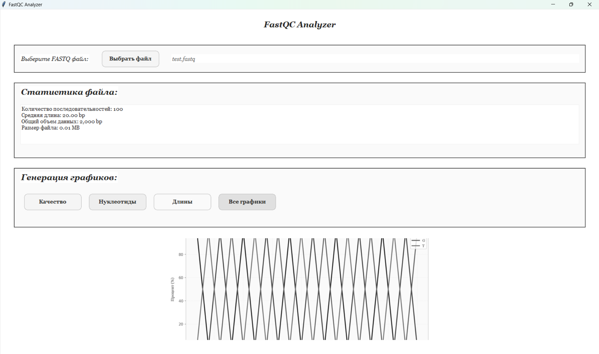
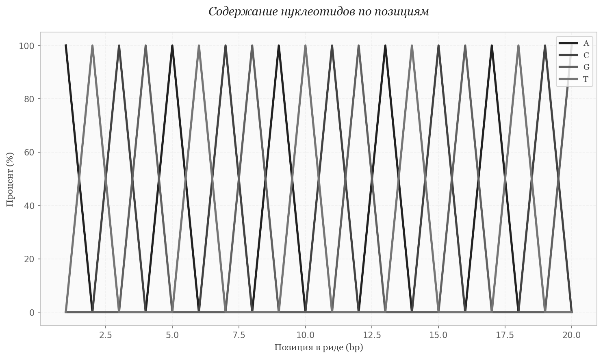

# FastQCAnalyzer
Gray is also a decent color!

**Профессиональный анализатор FASTQ файлов с элегантным GUI**

[](https://python.org)
[](LICENSE)
[](https://docs.python.org/3/library/tkinter.html)






## Быстрый старт

## 1. Скачай и запусти
```bash
# Клонируй репозиторий
git clone https://github.com/yourusername/FastQCAnalyzer.git

## Перейди в папку
cd FastQCAnalyzer

## Запусти
python fastq_analyzer.py
```
### 2. Используй
1. Нажми "Выбрать файл"

2. Выбери свой .fastq или .fq файл

3. Смотри статистику в реальном времени

4. Генерируй красивые графики в один клик

## Технологии
**Python 3.8+** - основной язык

**Tkinter** - нативный GUI фреймворк

**Matplotlib** - профессиональные графики

**Pillow** - работа с изображениями

**Generators** - оптимизация памяти O(1)

## Структура проекта
FastQC_Analyzer/
├── fastq.py
├── README.md
├── LICENSE
├── testfastq
└── images/
├── content.png
├── length.png
├── promo1.png
└── quality.png
## Лицензия

